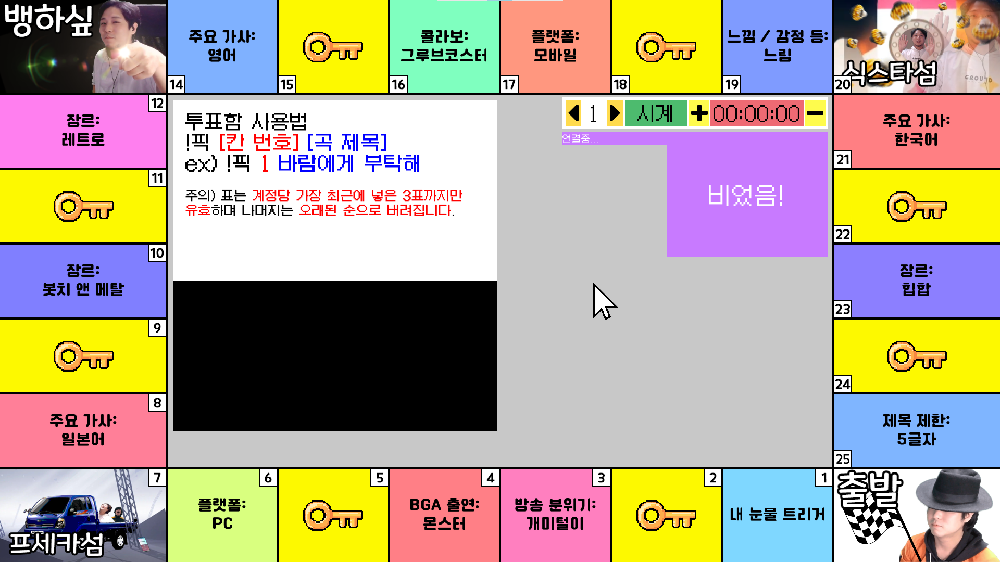
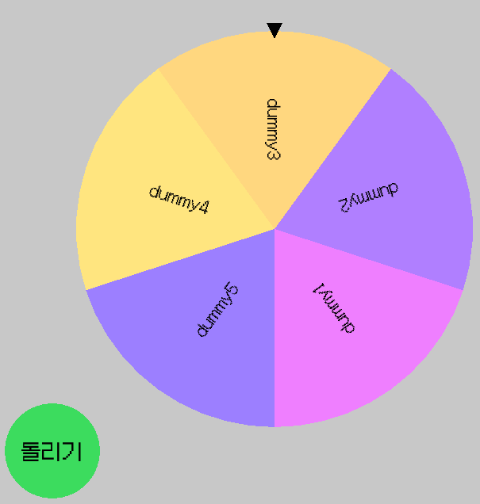
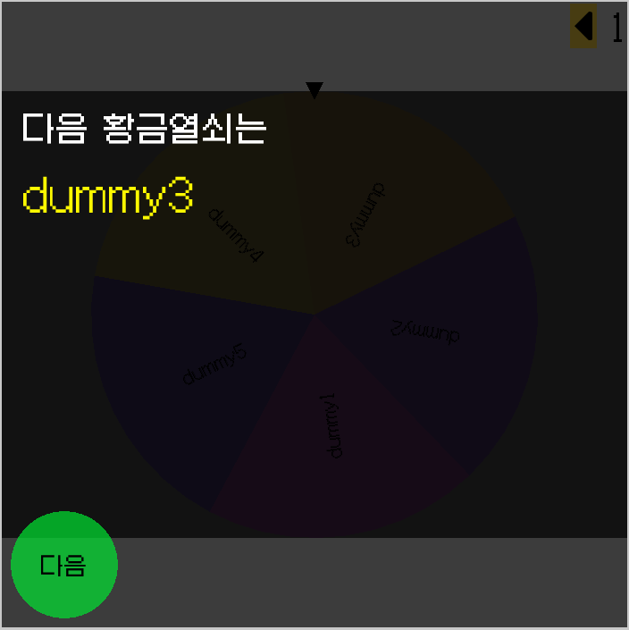
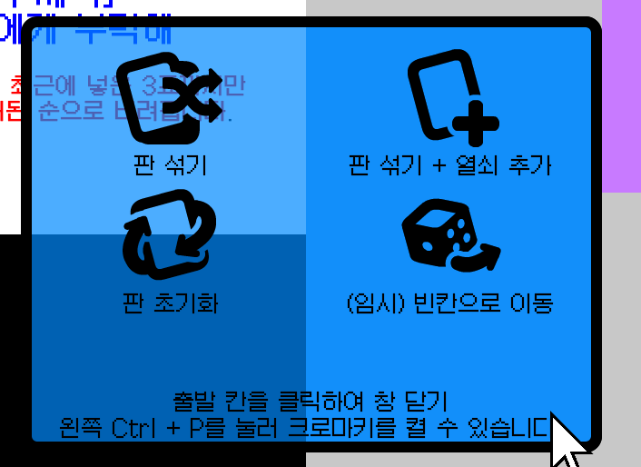
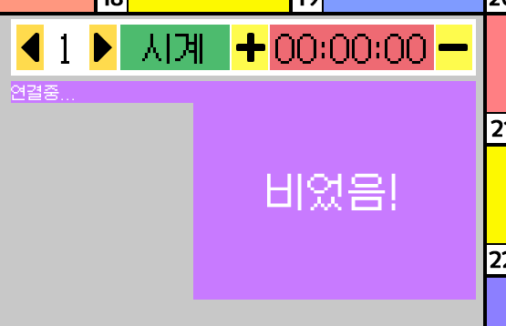

# 황금열쇠 Mk.3

## 현재 버전 : 2.1

  - Ver.2.0: 코드를 전체적으로 다시 작성했습니다.

  - **1920 $\times$ 1081** 해상도에 **보더리스 창 모드**로 고정됩니다. **왼쪽 컨트롤키와 탭키를 동시에** 눌러 프로그램이 출력될 모니터를 변경할 수 있습니다. *(주의: 1920 $\times$ 1081 해상도만 있습니다.)*
    
  - **NEW!** 판때기 **칸별 추첨 기능**이 추가되었습니다.


  - 프로그램이 실행되면 로딩 시간을 거쳐 판때기가 표시됩니다.
    - 판때기가 표시되어 있는 동안 표를 받습니다.
    - 표는 **트위치 채팅으로 다음 형식으로 보내야** 집계됩니다. ***형식을 따르지 않는 표는 받지 않습니다.***
    ```
    !픽 [칸 번호] [곡 제목]
    ```
    - 칸 번호는 **1부터 25까지**입니다. ***해당 범위를 벗어나는 표는 받지 않습니다.***
    - 트수 각각의 표는 **최근 3표까지만 유효**합니다. 이 이상으로 표를 넣을 경우, **가장 오래된 표부터 차례대로 제외**됩니다.
    - 또한, 트수 각각은 가장 최근 표를 행사한지 **30초 내에 다른 곡을 선곡할 수 없습니다.**
    - 화면 속의 판때기 칸에 마우스를 갖다대어 **해당 칸에 던져진 표를 확인**할 수 있습니다.
    - 추첨 버튼을 클릭하여 **해당 칸에 던져진 표들 중에서 다음 곡을 추첨**합니다. **추첨을 진행할 때까지** ***누가 그 곡을 골랐는지는 공개되지 않습니다.***
    - 해당 곡은 이후 별도의 리스트로 기록되며, **해당 리스트에 기록된 유저는** ***이번 게임에서 제외***됩니다. (툴을 끄면 리셋됩니다.)
    - **NEW!** 이제 표가 수집되면 누가 표를 넣었는지가 **상시로** 표시됩니다. 해당 트수가 **어떤 곡을 어디에 넣었는지는 표시되지 않습니다.**

  - **NEW!** 무인도가 이제 판을 섞을때마다 랜덤으로 등장합니다.
    - **뱅섬, 식스타섬, 프세카섬**이 추가되었습니다.
    - 무인도는 **별도의 선곡 풀**을 가집니다. 이 선곡풀은 **30초의 쿨타임**을 가지며, **1인당 총합 1표**만 행사할 수 있습니다.


  - 황금열쇠를 누르면 황금열쇠 추첨 화면으로 넘어갑니다.
    - **돌리기** 버튼을 누르면 추첨이 시작되며, **멈추기**를 눌러 멈춘 칸의 황금열쇠 칸이 선택됩니다.

    - 추첨된 황금열쇠의 항목이 화면에 크게 표시되며, 다음 버튼을 눌러주면 사라집니다.
    - **NEW!** 일부 항목은 **별도의 인벤토리에 저장**되며, 횟수를 조정할 수 있습니다. (자세히는 후술합니다.)
    - **수정**: 곡 추첨으로 돌아가려면 **아무 황금열쇠가 아닌 칸을 클릭**하면 됩니다.


  - 시작 칸을 누르면 판 섞기 메뉴가 표시됩니다.
    - "판 섞기"를 선택하면 판의 항목과 황금열쇠가 랜덤으로 섞입니다. **해당 칸에 누적된 표도 함께 이동됩니다.**
    - "판 섞기 + 열쇠 추가"를 선택하면 항목 하나가 황금열쇠로 전환되고 판이 섞입니다. **지워진 칸의 항목 및 표는 툴을 끄기 전까지 유지됩니다.**
    - "판 초기화"를 선택하면 초기 상태의 판으로 복귀합니다.
    - "(임시) 빈칸으로 이동"을 선택하면 빈 화면으로 넘어갑니다. 다른 칸을 클릭하여 돌아올 수 있습니다.
    - **왼쪽 컨트롤키와 P키를 동시에** 눌러 **크로마키를 활성화/비활성화**할 수 있습니다.


  - 판때기 화면에 타이머가 표시됩니다.
    - 바퀴 수는 1부터 3까지 조절할 수 있습니다.
    - 시계, 반시계 방향을 표시할 수 있습니다. 글자를 눌러 전환합니다.
    - 타이머는 글자를 눌러 시작하고 중지할 수 있습니다. +와 -를 누르면 1분 단위로 시간을 변경할 수 있습니다.
  - **NEW!** 인벤토리가 추가되었습니다.
    - **3턴간** 항목 또는 **(1회)** 항목은 여기에 저장됩니다.
    - **-1** 버튼을 눌러 횟수를 줄일 수 있습니다. 횟수가 **0이 되면 자동으로 제거**됩니다.
    - **+1** 버튼을 눌러 횟수를 늘릴 수 있습니다. **(1회)**항목은 해당되지 않습니다.
    - **곡 추첨 - 결정** 버튼을 클릭하면 **3턴간** 항목들의 횟수가 **자동으로 1 줄어듭니다.**

## 로드맵

- 항목 추가/수정 기능
- 랜덤 이동 전용 돌림판 기능
- X맨 전용 돌림판 기능
- 황금열쇠 돌림판 세기 조절 기능
  - 누르고 있으면 게이지가 차오르고 놓으면 돌림판이 돌아갈 예정
  - 게이지가 넘치면 **오버차지 룰** (일정 확률로 역방향으로 일정치 추가로 돌아가는 기능) 적용할 예정

## 라이센스 및 저작권

이 프로그램은 MIT 라이센스를 따르고 있습니다. 자세한 사항은 [여기](https://github.com/smh0505/GoldenKeyMK3/blob/master/license)를 참고.

또한 이 프로그램에 포함된 각각의 리소스의 저작권은 각 저작권자에게 있습니다. 아래는 그 리스트입니다.

- [갈무리 폰트](https://galmuri.quiple.dev/) - 이민서 님
- [리듬마블 로고](https://tgd.kr/s/arpa__/67034537) - 채팅_안치는사람 님 & cannabee 님
- 인트로에 쓰인 본인 프사 - 본인
- 그 외 이미지들 - [Kenney](https://kenney.itch.io/kenney-game-assets)

## Special Thanks

김편집\
채팅_안치는사람\
cannabee\
양치기양

그리고 여러분