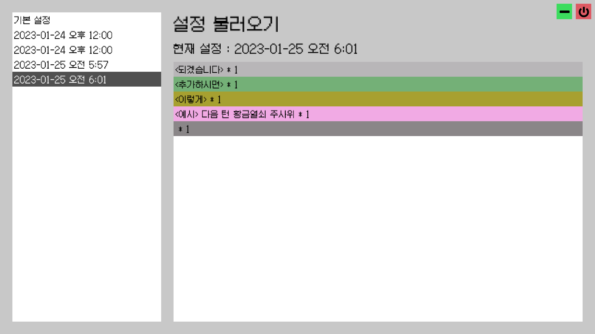
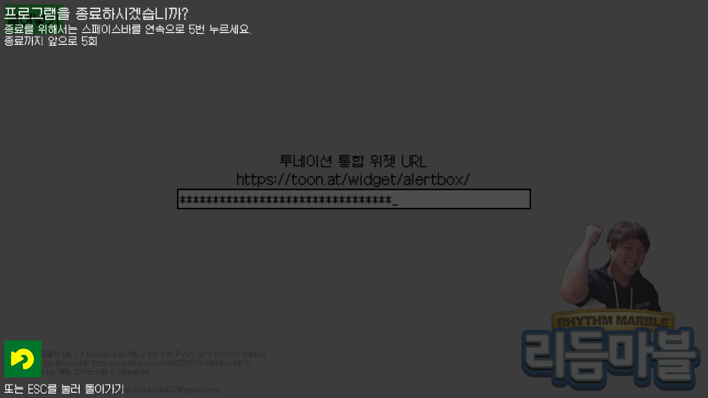

# 황금열쇠 Mk.3

## 현재 버전 : 1.1

- 인트로 애니메이션이 추가되었습니다.
  - 날코딩으로 만드느라 힘들었습니다. 읽어보고 싶으신 분들은 [클릭하세요](https://github.com/smh0505/GoldenKeyMK3/blob/master/Script/Intro.cs).

- **기록 파일의 확장자가 `.yml`로 변경**됩니다.
  - `default.yml` 파일 수정시 다음 형식을 따라주세요.
  ```yaml
  key: ... # 투네이션 통합 위젯 URL 비밀키 부분
  values: # 디폴트 항목들
    - 항목 1
    - 항목 2
    - ...
  ```

- **로그 기능이 추가**되었습니다.

  - 프로그램 종료시 `Logs` 폴더에 `log-yyyy-mm-dd-hh-mm-ss.yml` 파일을 저장하며 황금열쇠 돌림판의 마지막 모습을 다음과 같은 형식으로 기록합니다.
  ```yaml
  - name: 디맥섬으로 이동 # 항목 이름
    count: 1 # 항목 갯수: 반드시 0 이상으로 해주세요
    color: # 항목 색: hex값을 따릅니다.
      r: 255 # 레드값: 0 이상 255 이하의 정수
      g: 255 # 그린값: 0 이상 255 이하의 정수
      b: 255 # 블루값: 0 이상 255 이하의 정수
      a: 255 # 알파값: 항상 255
  - name: ... # 이하 반복
  ```
  - 로그 수정시에는 위 형식을 따라 수정해주시면 됩니다.

- 비상탈출 상황을 고려하여 **종료 방식이 변경**됩니다.

  - `ESC`키를 눌러 종료 창을 엽니다.
  - 급히 종료해야 하는 상황을 고려하여 **스페이스바를 연타하여 프로그램을 끄는 방식**입니다.
  - 실수로 종료 창을 연 상황을 고려하여 **종료에 필요한 연타 횟수는 5회**이며, **취소하면 리셋**됩니다.

- **1920 $\times$ 1080** 해상도에 **보더리스 창 모드**로 고정됩니다.
  - 윈도우 11 환경에서 `Win + Tab`이 먹히지 않는 문제를 발견하여 **최소화 버튼이 추가**되었습니다.
  

## 로드맵

- 항목 추가/수정 기능
- 랜덤 이동 전용 돌림판 기능
- X맨 전용 돌림판 기능
- 황금열쇠 돌림판 세기 조절 기능
  - 누르고 있으면 게이지가 차오르고 놓으면 돌림판이 돌아갈 예정
  - 게이지가 넘치면 **오버차지 룰** (일정 확률로 역방향으로 일정치 추가로 돌아가는 기능) 적용할 예정

## 라이센스 및 저작권

이 프로그램은 MIT 라이센스를 따르고 있습니다. 자세한 사항은 [여기](https://github.com/smh0505/GoldenKeyMK3/blob/master/license)를 참고.

또한 이 프로그램에 포함된 각각의 리소스의 저작권은 각 저작권자에게 있습니다. 아래는 그 리스트입니다.

- [갈무리 폰트](https://galmuri.quiple.dev/) - 이민서 님
- [리듬마블 로고](https://tgd.kr/s/arpa__/67034537) - 채팅_안치는사람 님 & cannabee 님
- 인트로에 쓰인 본인 프사 - 본인
- 그 외 이미지들 - [Kenney](https://kenney.itch.io/kenney-game-assets)

## Special Thanks

김편집\
채팅_안치는사람\
cannabee\
양치기양

그리고 여러분